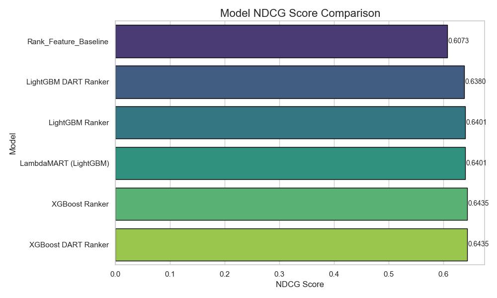
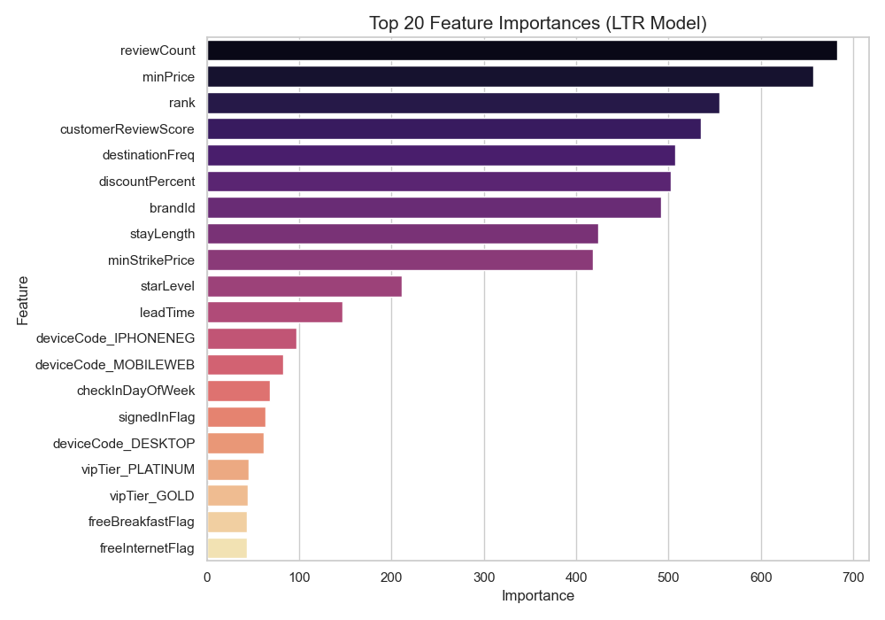
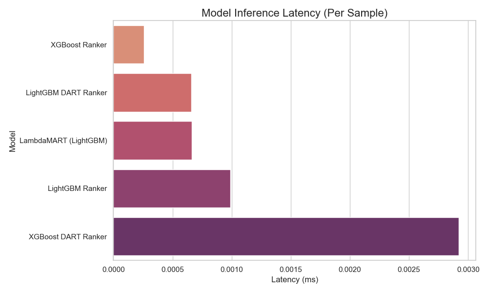

## Project Objective
The goal of this project is to build a machine learning solution that predicts which hotel listings have the highest probability of being booked. 

## Project Structure
```
├── main.py
├── requirements.txt
├── README.md
├── Assumptions and Exploratory Data Analysis (EDA).pdf
├── scripts/
│   ├── 1_preprocessing_and_eda.py
│   ├── 2_model_training_ltr.py
│   └── 3_evaluation_and_visualization.py
├── data/
│   └── case_study_dataset.parquet
├── models/
│   ├── trained_model_lightgbm_ranker.pkl
│   ├── trained_model_lightgbm_dart_ranker.pkl
│   ├── trained_model_xgboost_ranker.pkl
│   └── trained_model_xgboost_dart_ranker.pkl
└── visuals_and_results/
    ├── feature_importance_best_model.csv
    ├── feature_importance_best_model.png
    ├── inference_latency_comparison.csv
    ├── inference_latency_comparison.png
    ├── model_comparison_ndcg_scores.csv
    ├── ndcg_score_comparison.png
    ├── rank_comparison_table.png
    └── rank_comparison_table.csv
```

## Summary of Approach

### 1. Data Exploration & Cleaning
- Identified and corrected invalid date ranges (e.g., check-out before check-in).
- Removed unreasonable stay lengths (>90 days).
- Filled missing `destinationName` values with `"UNKNOWN"`.
- Replaced placeholder values (e.g., `-1`) with `NaN`.
- Capped outlier prices at the 99th percentile.
- Engineered new features: `stayLength`, `leadTime`, `weekendStay`, `discountPercent`, `logMinPrice`, etc.

### 2. Modeling Strategy
- Adopted **Learning-to-Rank (LTR)** models to better reflect real-world booking use cases.
- Implemented models:
  - LightGBM Ranker
  - LightGBM DART Ranker
  - XGBoost Ranker
  - XGBoost DART Ranker
  - LambdaMART (LightGBM)
- Original `rank` feature used as a **baseline** for comparison.
- Evaluation metric: **NDCG (Normalized Discounted Cumulative Gain)**

### 3. Feature Importance
- Top impactful features: `reviewCount`, `minPrice`, `rank`.

### 4. Baseline Comparison Results
| Model                 | NDCG Score |
|-----------------------|-------------|
| XGBoost DART Ranker   | 0.6435      |
| XGBoost Ranker        | 0.6435      |
| LambdaMART (LightGBM) | 0.6360      |
| LightGBM DART Ranker  | 0.6380      |
| Rank_Feature_Baseline | 0.6073      |

## Sample Output Visualizations

### Model NDCG Score Comparison
This plot compares the NDCG@10 scores across all trained models and the baseline.


### Feature Importance (Best Model)
Displays the top contributing features to the best-performing model's decisions.


### Inference Latency Comparison
Compares per-sample latency across different models for deployment feasibility.


### Ranking Difference Distribution
Shows the distribution of differences between original rank and LTR-predicted rank.


## Scalability & Deployment
Inference Latency Comparison (per sample)

| Model                 | Latency (ms) |
|-----------------------|--------------|
| XGBoost Ranker        | 0.00024      |
| LambdaMART (LightGBM) | 0.00065      |
| LightGBM DART Ranker  | 0.00067      |
| LightGBM Ranker       | 0.00096      |
| XGBoost DART Ranker   | 0.00292      |

- Code modularized for pipeline scalability.
- Trained models saved with `joblib` and easily reloadable.

## Setup & Installation
```bash
# Create virtual environment (optional)
python -m venv venv
source venv/bin/activate  ]

# Install dependencies
pip install -r requirements.txt
```

## Running the Code
```bash
python main.py
```

## Deliverables
- ✅ Runnable Python scripts for EDA, preprocessing, modeling, evaluation, and visualization.
- ✅ Clean, modular, and well-documented codebase.
- ✅ README file summarizing the approach, results, and setup instructions.

## Known Limitations
- NDCG evaluates relevance, not business value (e.g., revenue uplift).
- User context and personalization not included.
- Ranking is based on static snapshot — no time-series modeling.
- No hyperparameter tuning yet (see Future Work)

## Assumptions
- Booking/click labels are used to define new ranking labels.
- Negative and extreme values treated as data quality issues.
- Models optimized for relative ranking performance, not absolute booking probability.
- Detailed EDA and Assumptions document in `Assumptions and Exploratory Data Analysis (EDA).pdf`

## Future Work (System Improvements)
- Hyperparameter tuning with Optuna or grid search.
- Context-aware ranking (user personalization).
- Ensemble blending of LTR models.
- Advanced interpretability with SHAP.
- Time-aware modeling for seasonality and user recency.

## Author
- Stefan Juang
